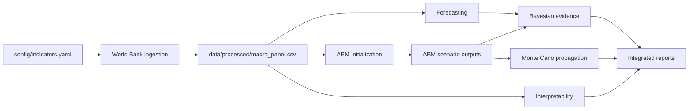

# Project Architecture

## Module Overview

- `src/data`: World Bank ingestion, raw response storage, panel cleaning, and
  missingness reporting.
- `src/models`: baseline forecasting, modern benchmarks, evaluation, and
  interpretability.
- `src/abm`: ECAIF agents, resources, shocks, environment, metrics, and
  scenario simulation.
- `src/bayesian`: weak priors, evidence proxies, posterior updates, and scenario
  probability evolution.
- `src/monte_carlo`: parameter distributions, scenario perturbation, repeated
  ABM runs, and sensitivity rankings.
- `src/utils`: configuration, logging, reproducibility, and export helpers.

## Data Flow

## Model Relationships

Forecasting produces GDP-growth benchmark errors and predictions.
Interpretability explains tree-model signal structure using lagged predictors.
ABM outputs provide scenario dynamics for conceptual mechanisms. Bayesian and
Monte Carlo layers quantify uncertainty conditional on those assumptions.

## Reproducibility Strategy

All scripts resolve paths from the shared project config, write logs under
`reports/logs/`, record metadata under `reports/`, use deterministic seeds where
applicable, and preserve generated tables and figures under the reports tree.
